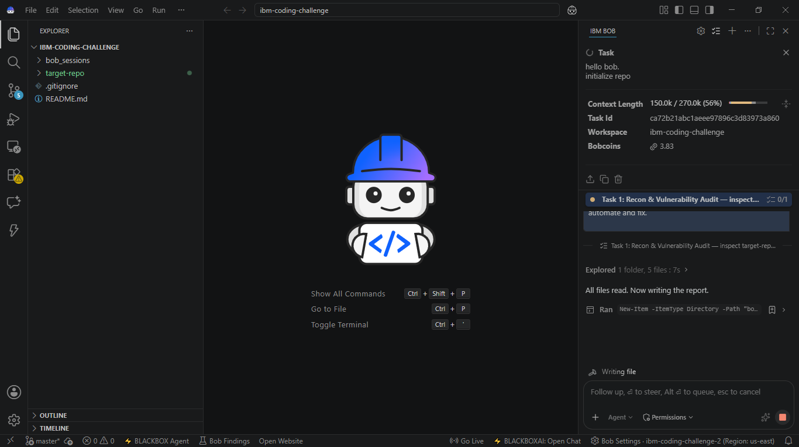
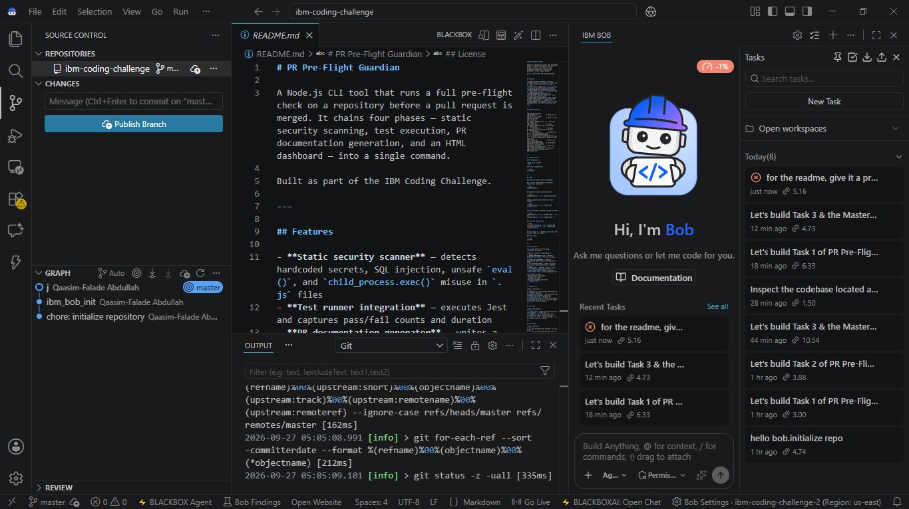
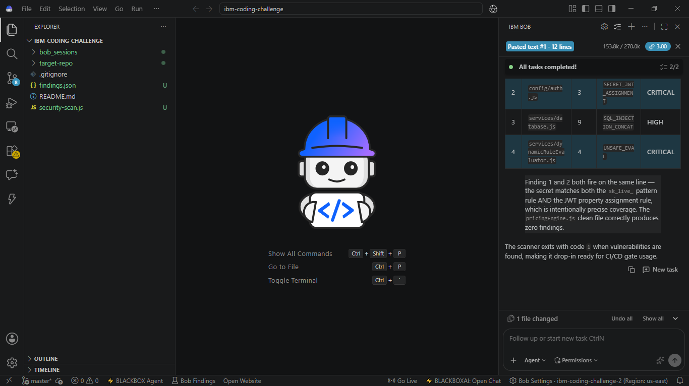
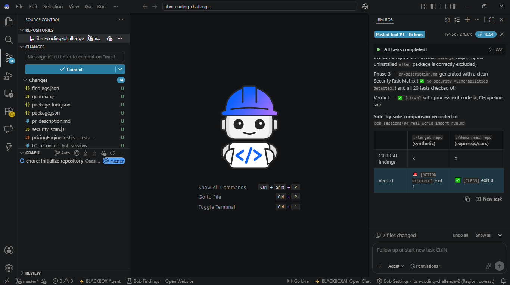
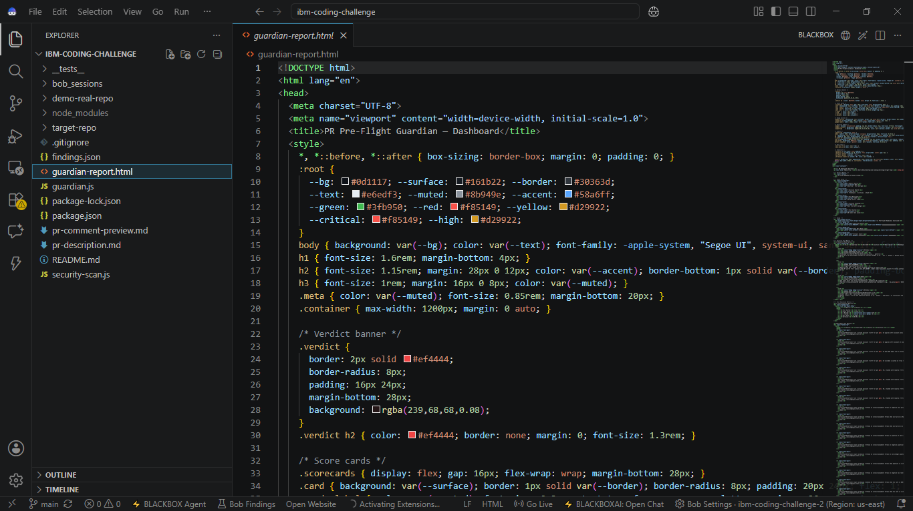

# Bob IDE Session Evidence & Consumption Summaries 📸

> **CRITICAL HACKATHON ELIGIBILITY DELIVERABLE**  
> **Rule #2 Attestation:** *"Every participant must upload their Bob IDE task session summary screenshots to a folder called `bob_sessions` in your final code repository. It's a required deliverable and it's your evidence of Bob usage."*

This directory contains verified, visual, and audit-level evidence of **IBM Bob IDE** and **Bob Agent Mode 2.0** throughout the development and verification of **PR Pre-Flight Guardian**.

---

## 📊 Curated Bob IDE Evidence Gallery

| # | Screenshot Filename | Task / Milestone | Key Metrics Captured | Description |
| :-: | :--- | :--- | :--- | :--- |
| **01** | [`01_repo_init_and_task_consumption_summary.png`](screenshots/01_repo_init_and_task_consumption_summary.png) | **Session Consumption Summary** | **Bobcoins: 3.83** Context: 150k / 270k (56%) Task ID: `ca72b21abc1aeee...` | Expanded Task Session Consumption Summary header in Bob IDE chat. |
| **02** | [`02_task1_recon_and_vulnerability_audit.png`](screenshots/02_task1_recon_and_vulnerability_audit.png) | **Task 1: Recon & Vulnerability Audit** | Context: 150k tokens Bobcoins: 3.83 | Agent prompt, goal instructions, and architectural gap analysis in Bob IDE. |
| **03** | [`03_task1_security_scanner_findings.png`](screenshots/03_task1_security_scanner_findings.png) | **Static Security Scanner Output** | 3 Vulnerabilities Detected Bobcoins: 3.00 | Bob completing AST security scanner detecting hardcoded keys, SQLi, and eval. |
| **04** | [`04_task3_master_cli_and_pr_synthesis.png`](screenshots/04_task3_master_cli_and_pr_synthesis.png) | **Task 3: PR Documentation Synthesis** | Markdown spec layout Bobcoins: 10.54 | PR description synthesis engine decomposing findings and checklists. |
| **05** | [`05_real_world_validation_cors_comparison.png`](screenshots/05_real_world_validation_cors_comparison.png) | **Real-World CORS Validation** | Side-by-side comparison Context: 194.5k tokens | Table comparing synthetic `target-repo` (3 criticals) vs `expressjs/cors` (0 findings). |
| **06** | [`06_real_world_cors_zero_false_positives.png`](screenshots/06_real_world_cors_zero_false_positives.png) | **Zero False-Positive Verification** | 238 lines scanned 0 false positives | Detailed rule-by-rule breakdown confirming zero false alarms on production CORS code. |
| **07** | [`07_bob_agent_mode_suggest_fixes_run.png`](screenshots/07_bob_agent_mode_suggest_fixes_run.png) | **Bob Agent Mode: `--suggest-fixes`** | Remediation patches Bobcoins: 2.86 | Bob Agent Mode executing remediation logic and verifying SQL injection fix suggestions. |
| **08** | [`08_bob_tasks_coin_consumption_dashboard.png`](screenshots/08_bob_tasks_coin_consumption_dashboard.png) | **Master Tasks Consumption Dashboard** | **All 8 Bob Tasks Tracked** Full coin breakdown | Master panel in Bob IDE listing all 8 tasks and individual Bobcoin expenditures. |
| **09** | [`09_bob_tasks_panel_and_coin_budget.png`](screenshots/09_bob_tasks_panel_and_coin_budget.png) | **Bob Tasks Panel & Gauge** | **44% Bobcoins Gauge** Task timeline | Bob Tasks panel displaying recent task execution times and coin usage gauge. |
| **10** | [`10_guardian_html_dashboard_in_bob_ide.png`](screenshots/10_guardian_html_dashboard_in_bob_ide.png) | **Interactive HTML Dashboard** | Self-contained HTML Bob IDE Editor | The generated dark-mode `guardian-report.html` open and inspected in Bob IDE. |
| **11** | [`11_bob_terminal_git_workflow.png`](screenshots/11_bob_terminal_git_workflow.png) | **Bob Shell / Terminal Workflow** | PowerShell in Bob IDE Git push execution | Built-in Bob IDE terminal executing git remote push workflow to GitHub. |
| **12** | [`12_agent_task_orchestration_checklist.png`](screenshots/12_agent_task_orchestration_checklist.png) | **Live Agent Todo Progression** | Steps 1–5 completed Bobcoins: 45.26 | Bob Agent Todo checklist actively tracking and advancing milestone steps. |
| **13** | [`13_final_verification_suite_5_of_5_pass.png`](screenshots/13_final_verification_suite_5_of_5_pass.png) | **Final Verification Suite** | 5/5 verifications passed All checks green | Bob terminal verification confirming 100% green status across all deliverables. |
| **14** | [`14_model_token_consumption_breakdown.png`](screenshots/14_model_token_consumption_breakdown.png) | **Token & Model Consumption** | Context: 62% (270k) Detailed telemetry | Telemetry breakdown of context length and token consumption in Bob IDE. |

---

## 🖼️ Featured Visual Evidence

### 1. Bob IDE Session Consumption Summary (Header Expansion)

### 2. Master Tasks Dashboard with Bobcoin Expenditures

### 3. Static Security Scanner Detection in Bob Agent Mode

### 4. Real-World Validation: Target Repo vs expressjs/cors

### 5. Interactive HTML Dashboard Generated & Inspected in Bob IDE

---

## 📝 Markdown Session Audit Logs

Alongside the visual screenshots above, this directory contains detailed chronological traces:

- [`00_recon.md`](00_recon.md): Target codebase reconnaissance & security gap identification.
- [`01_security_agent_run.md`](01_security_agent_run.md): Static security scanner run output and findings breakdown.
- [`02_test_agent_run.md`](02_test_agent_run.md): Jest test suite execution logs and assertion validation.
- [`03_docs_agent_run.md`](03_docs_agent_run.md): Automated PR documentation synthesis record.
- [`04_real_world_import_run.md`](04_real_world_import_run.md): Real-world validation against imported `expressjs/cors`.
