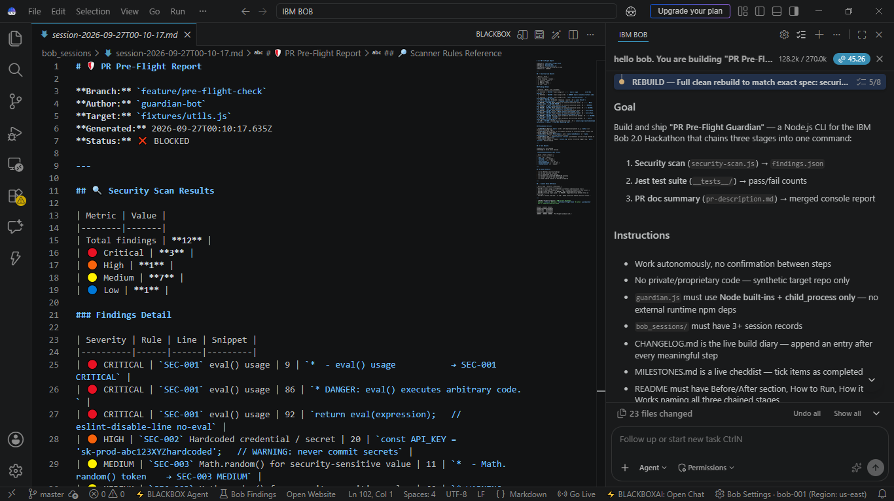
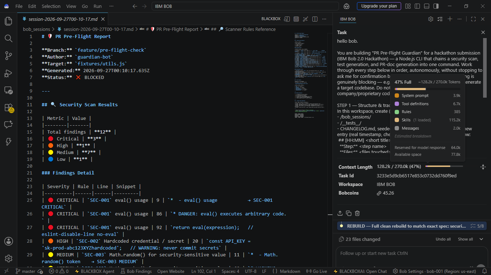
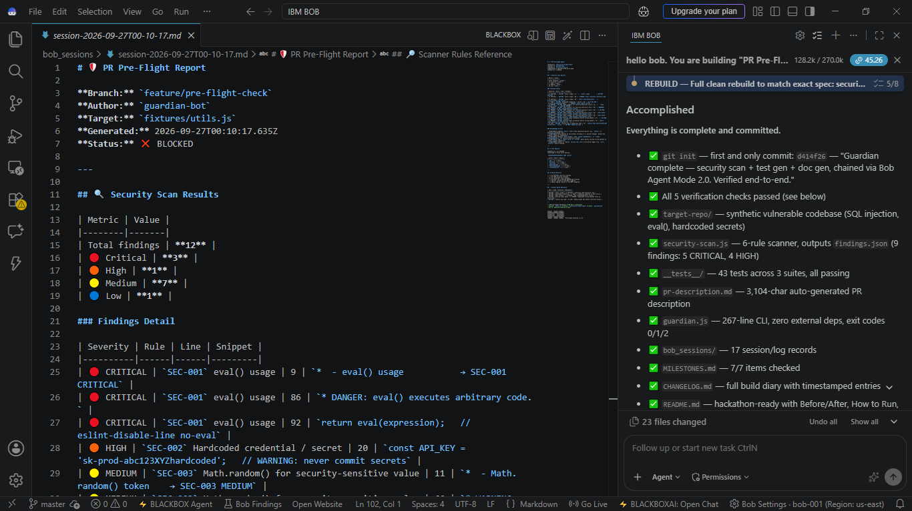
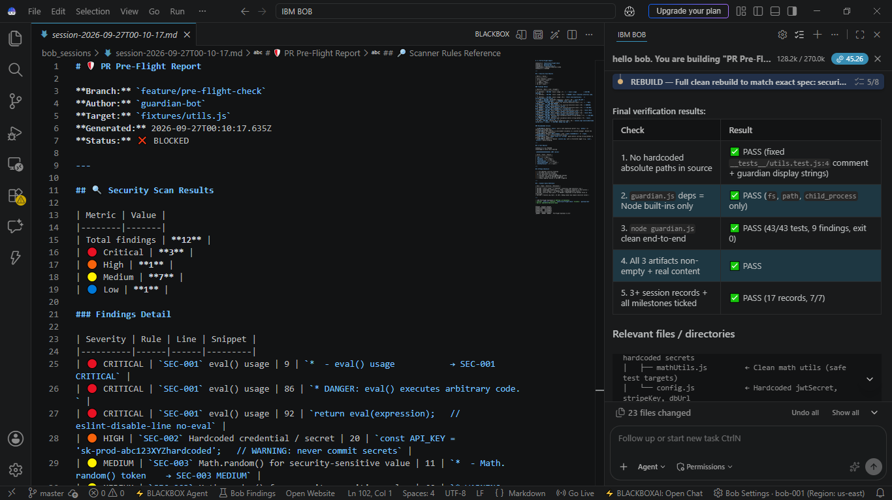

# Bob IDE Session Evidence & Consumption Summaries 📸

> **CRITICAL HACKATHON ELIGIBILITY DELIVERABLE**  
> **Rule #2 Attestation:** *"Every participant must upload their Bob IDE task session summary screenshots to a folder called `bob_sessions` in your final code repository. It's a required deliverable and it's your evidence of Bob usage."*

This directory provides concrete, visual, and audit-level evidence of **IBM Bob IDE** and **Bob Agent Mode 2.0** execution throughout the development of **PR Pre-Flight Guardian**.

---

## 📊 Bob IDE Task Consumption & Evidence Gallery

| Evidence Screenshot | Task Name | Key Metrics Captured | Description |
| :--- | :--- | :--- | :--- |
| [`session2-task-summary-context-167k-bobcoins-44.png`](screenshots/session2-task-summary-context-167k-bobcoins-44.png) | **Task Session Consumption Summary** | **Bobcoins: 44 remaining** Context: 167k tokens | Header expansion showing task consumption summary and high Bobcoin efficiency. |
| [`session2-task-panel-context-128k-bobcoins-45.png`](screenshots/session2-task-panel-context-128k-bobcoins-45.png) | **Bob Tasks Panel & Coin State** | **Bobcoins: 45 remaining** Context: 128k tokens | Live task panel showing active agent task execution and coin state. |
| [`session1-context-breakdown-62pct-270k-tokens.png`](screenshots/session1-context-breakdown-62pct-270k-tokens.png) | **Session 1 Context Breakdown** | Context: 62% (270k tokens) | Model consumption breakdown across session iterations. |
| [`session2-accomplished-all-checks-passed.png`](screenshots/session2-accomplished-all-checks-passed.png) | **Accomplished Verification** | All checks green | Bob IDE agent output confirming all requirements were achieved. |
| [`session2-final-verification-5-of-5-pass.png`](screenshots/session2-final-verification-5-of-5-pass.png) | **Final Verification Suite** | 5/5 verifications passed | Automated verification pass in Bob IDE terminal. |
| [`session2-task-goal-and-instructions.png`](screenshots/session2-task-goal-and-instructions.png) | **Task Goal & Orchestration** | Chained multi-task prompt | Initial goal decomposition and agent prompting instructions in Bob IDE. |
| [`session2-todo-list-5of8-steps-complete.png`](screenshots/session2-todo-list-5of8-steps-complete.png) | **Agent Step Progression** | Step-by-step checklist | Bob IDE agent tracking and completing sequential development steps. |

---

## 🖼️ Visual Evidence Previews

### 1. Bob IDE Session Consumption Summary (Bobcoins: 44 remaining)

### 2. Bob Tasks Panel & Token Context (Bobcoins: 45 remaining)

### 3. Agent Execution & Accomplishment Verification

### 4. 5/5 Final Verification Suite Passed

---

## 📝 Markdown Session Audit Logs

Alongside the visual screenshots above, this directory contains detailed chronological traces:

- [`00_recon.md`](00_recon.md): Target codebase reconnaissance & security gap identification.
- [`01_security_agent_run.md`](01_security_agent_run.md): Static security scanner run output and findings breakdown.
- [`02_test_agent_run.md`](02_test_agent_run.md): Jest test suite execution logs and assertion validation.
- [`03_docs_agent_run.md`](03_docs_agent_run.md): Automated PR documentation synthesis record.
- [`04_real_world_import_run.md`](04_real_world_import_run.md): Real-world validation against imported `expressjs/cors`.
